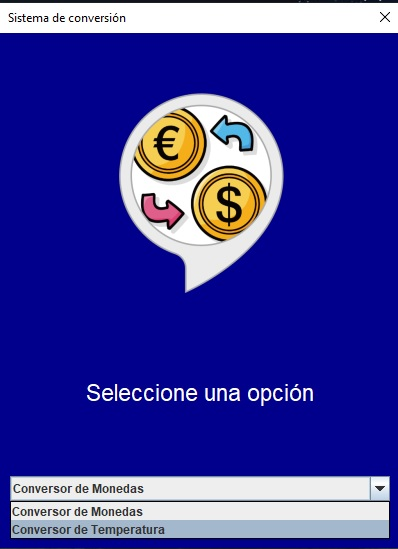

# conversormoneda

  
  

Este proyecto es  un programa de conversión de monedas que te permite convertir entre diferentes divisas de manera fácil y rápida.

Características principales
Conversión de monedas: El programa te permite convertir entre diferentes monedas, incluyendo pesos, dólares, euros, libras esterlinas, yenes japoneses, y won surcoreano.
Tipos de cambio actualizados: Los tipos de cambio utilizados para las conversiones se actualizan regularmente para proporcionar resultados precisos.
Interfaz intuitiva: El programa cuenta con una interfaz gráfica de usuario fácil de usar, que te guiará a través del proceso de conversión paso a paso.
Instrucciones de instalación
Clona este repositorio en tu máquina local.
Asegúrate de tener instalado Java en tu sistema.
Abre el proyecto en tu IDE favorito.
Compila y ejecuta el archivo conversor_monedas.java.
Instrucciones de uso
Abre el programa y selecciona la opción de conversión de monedas.
Ingresa el valor que deseas convertir.
Selecciona las monedas de origen y destino.
Haz clic en el botón "Convertir" para obtener el resultado de la conversión.
El programa mostrará el resultado en la pantalla.

#challengeoneconversorlatam5
